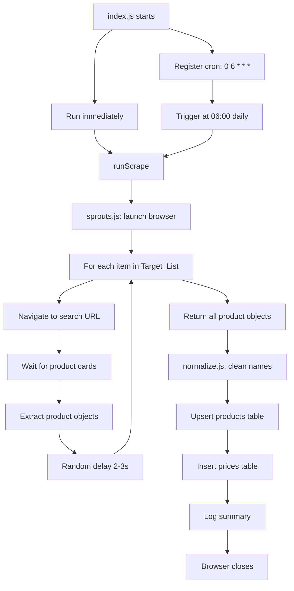

# Design Document: SLO Grocery Scraper

## Overview

The SLO Grocery Scraper is a standalone Node.js application that runs on a daily schedule, visits the Sprouts Farmers Market website, extracts current grocery prices for 15 predefined items, and persists the results to a Supabase (Postgres) database. It is designed as a go/no-go pilot: if Sprouts scraping proves reliable, the architecture will be extended to cover Vons and Ralphs in San Luis Obispo.

The system is intentionally simple — no web server, no API, no queue. It is a long-running Node.js process that wakes up once a day, does its work, logs a summary, and goes back to sleep.

### Key Design Decisions

- **Playwright over Puppeteer**: Playwright provides better built-in auto-waiting for dynamic DOM elements, which is critical for Sprouts' React SPA. It also integrates cleanly with `playwright-extra` and `puppeteer-extra-plugin-stealth` for anti-detection. ([playwright-extra on npm](https://www.npmjs.com/package/playwright-extra))
- **Sequential item processing with random delays**: Rather than parallelizing requests (which would look bot-like), each of the 15 items is searched sequentially with a 2–3 second random delay between requests.
- **Supabase JS client for all DB operations**: The `@supabase/supabase-js` client handles connection pooling, retries, and type-safe queries. Case-insensitive product lookups use `.ilike()`.
- **node-cron for scheduling**: A lightweight, pure-JS cron scheduler that keeps the process alive between runs. ([node-cron on npm](https://www.npmjs.com/package/node-cron))

---

## Architecture

The application follows a simple pipeline architecture: **Schedule → Scrape → Normalize → Upsert → Log**.



### Module Responsibilities

| Module | Responsibility |
|---|---|
| `index.js` | Entry point. Registers cron schedule, triggers immediate run, handles top-level errors. |
| `stores/sprouts.js` | Launches browser, iterates Target_List, extracts raw product objects from DOM. |
| `utils/normalize.js` | Pure function: cleans and lowercases raw product name strings. |
| `utils/supabase.js` | Initializes and exports the Supabase client. Validates env vars at startup. |

---

## Components and Interfaces

### `index.js` — Orchestrator

```js
// Main entry point
async function runScrape(): Promise<void>
```

Responsibilities:
1. Calls `scroutsScrape()` to get raw product objects
2. For each product: normalizes name, upserts product row, inserts price row
3. Logs the run summary
4. Catches and logs any unhandled errors without crashing the process

**Cron registration:**
```js
cron.schedule('0 6 * * *', () => runScrape().catch(console.error));
runScrape().catch(console.error); // immediate run on startup
```

---

### `stores/sprouts.js` — Sprouts Module

```js
/**
 * @returns {Promise<RawProduct[]>} Array of raw product objects
 */
async function scrape(): Promise<RawProduct[]>
```

**RawProduct shape:**
```js
{
  name: string,          // raw product name from DOM
  price: string,         // current price string, e.g. "$3.99"
  originalPrice: string | null,  // regular price if on sale, else null
  sourceUrl: string      // the search URL used
}
```

Internal flow:
1. Launch Playwright Chromium with stealth plugin and realistic user agent
2. For each item in `TARGET_LIST`:
   a. Navigate to `https://www.sprouts.com/search?query=<item>`
   b. Wait for product card selector (with timeout)
   c. Extract all product cards on the page
   d. Push extracted objects to results array
   e. Wait random 2000–3000ms before next item
3. Close browser
4. Return results array

**Error handling per item:**
- Timeout or navigation error → log warning, push nothing for that item, continue
- No product cards found → log warning, continue

---

### `utils/normalize.js` — Normalizer

```js
/**
 * Cleans and standardizes a raw product name string.
 * Pure function — no side effects.
 * @param {string} raw
 * @returns {string}
 */
function normalize(raw: string): string
```

Transformation pipeline (applied in order):
1. Trim leading/trailing whitespace
2. Convert to lowercase
3. Remove characters that are not alphanumeric, spaces, or hyphens (strip punctuation/special chars)
4. Collapse multiple consecutive spaces into one
5. Trim again (in case step 3 left leading/trailing spaces)

This function is a pure transformation — it has no I/O and no state. It is idempotent: `normalize(normalize(x)) === normalize(x)` for all valid inputs.

---

### `utils/supabase.js` — Supabase Client

```js
/**
 * Initializes and exports the Supabase client.
 * Throws at module load time if env vars are missing.
 */
const supabase: SupabaseClient
```

Validation logic:
```js
const url = process.env.SUPABASE_URL;
const key = process.env.SUPABASE_SERVICE_ROLE_KEY;
if (!url) throw new Error('Missing required environment variable: SUPABASE_URL');
if (!key) throw new Error('Missing required environment variable: SUPABASE_SERVICE_ROLE_KEY');
```

---

## Data Models

### Database Schema

The scraper writes to three tables. The `stores` table is pre-seeded; the scraper only reads from it.

#### `stores` table (pre-seeded, read-only for scraper)

```sql
CREATE TABLE stores (
  id         UUID PRIMARY KEY DEFAULT gen_random_uuid(),
  name       TEXT NOT NULL,
  address    TEXT,
  created_at TIMESTAMPTZ DEFAULT now()
);

-- Pre-seeded row:
-- INSERT INTO stores (name, address) VALUES ('Sprouts', '1014 Madonna Rd, San Luis Obispo, CA');
```

#### `products` table

```sql
CREATE TABLE products (
  id         UUID PRIMARY KEY DEFAULT gen_random_uuid(),
  name       TEXT NOT NULL UNIQUE,
  created_at TIMESTAMPTZ DEFAULT now()
);
```

The `name` column has a `UNIQUE` constraint. The scraper uses a case-insensitive lookup (`.ilike('name', normalizedName)`) before deciding to insert or reuse.

#### `prices` table

```sql
CREATE TABLE prices (
  id             UUID PRIMARY KEY DEFAULT gen_random_uuid(),
  product_id     UUID NOT NULL REFERENCES products(id),
  store_id       UUID NOT NULL REFERENCES stores(id),
  price          NUMERIC(8,2) NOT NULL,
  original_price NUMERIC(8,2),
  scraped_at     TIMESTAMPTZ NOT NULL DEFAULT now(),
  source_url     TEXT
);
```

Every scraping run inserts new rows into `prices` — this table is append-only and forms the historical price record.

### In-Memory Data Shapes

#### `RawProduct` (output of `stores/sprouts.js`)

```js
{
  name: string,
  price: string,           // e.g. "$3.99" — not yet parsed
  originalPrice: string | null,
  sourceUrl: string
}
```

#### `NormalizedProduct` (after normalize + parse, input to DB writes)

```js
{
  name: string,            // normalized lowercase name
  price: number,           // parsed float, e.g. 3.99
  originalPrice: number | null,
  sourceUrl: string
}
```

#### `PriceInsert` (row written to `prices` table)

```js
{
  product_id:     string,  // UUID
  store_id:       string,  // UUID (Sprouts store)
  price:          number,  // numeric(8,2)
  original_price: number | null,
  scraped_at:     string,  // ISO 8601 with timezone
  source_url:     string
}
```

### Price Parsing

Price strings from the DOM (e.g. `"$3.99"`, `"3.99"`, `"$12.50"`) are parsed with:

```js
function parsePrice(raw) {
  const n = parseFloat(raw.replace(/[^0-9.]/g, ''));
  return isNaN(n) ? null : Math.round(n * 100) / 100;
}
```

If `parsePrice` returns `null`, the Orchestrator logs a warning and skips the price record for that item (Requirement 6.3).

### Product Upsert Logic

```
1. normalizedName = normalize(rawProduct.name)
2. existing = await supabase.from('products').select('id').ilike('name', normalizedName).single()
3. if existing:
     productId = existing.id
     newProductsCount unchanged
   else:
     { data } = await supabase.from('products').insert({ name: normalizedName }).select('id').single()
     productId = data.id
     newProductsCount++
4. Insert price row using productId
```

---

## Correctness Properties

*A property is a characteristic or behavior that should hold true across all valid executions of a system — essentially, a formal statement about what the system should do. Properties serve as the bridge between human-readable specifications and machine-verifiable correctness guarantees.*

### Property 1: Normalization is idempotent

*For any* string, applying `normalize` twice produces the same result as applying it once: `normalize(normalize(s)) === normalize(s)`.

**Validates: Requirements 4.5**

### Property 2: Normalization produces lowercase output

*For any* string, the output of `normalize` is equal to its own `.toLowerCase()` — it contains no uppercase characters.

**Validates: Requirements 4.3**

### Property 3: Normalization trims whitespace

*For any* string, the output of `normalize` has no leading or trailing whitespace.

**Validates: Requirements 4.2**

### Property 4: Normalization removes special characters

*For any* string, the output of `normalize` contains only characters matching `[a-z0-9 \-]` — no punctuation, symbols, or other special characters.

**Validates: Requirements 4.4**

### Property 5: parsePrice returns a valid decimal for valid price strings

*For any* string that represents a valid decimal number (with optional leading `$` or other non-numeric prefix), `parsePrice` returns a finite number with at most 2 decimal places (i.e., `Math.round(result * 100) / 100 === result`).

**Validates: Requirements 10.1**

### Property 6: parsePrice returns null for invalid price strings

*For any* string that contains no parseable numeric content (e.g., purely alphabetic strings, empty string), `parsePrice` returns `null`.

**Validates: Requirements 6.3**

### Property 7: Product upsert idempotency

*For any* normalized product name, running the upsert logic twice in a row produces exactly one row in the `products` table with that name, and both calls return the same UUID.

**Validates: Requirements 5.2, 5.3, 5.4**

### Property 8: Price records contain all required fields with correct types

*For any* valid normalized product object (with a parseable price), the inserted `prices` row contains: a valid UUID `product_id`, the Sprouts store UUID as `store_id`, a `price` value equal to `parsePrice(rawPrice)`, an `original_price` that is either a valid decimal or null, a timezone-aware `scraped_at` timestamp, and a non-empty `source_url`.

**Validates: Requirements 6.1, 6.2, 10.2, 10.3**

---

## Error Handling

### Browser Launch Failure (Requirement 1.3)

If Playwright fails to launch Chromium, the error is caught at the top of `scrape()`, logged with `console.error`, and re-thrown. The Orchestrator's `runScrape()` catches it, logs it, and returns without inserting any records. The process does not exit — the cron schedule remains active for the next day's run.

### Per-Item Scraping Errors (Requirements 2.7, 2.8)

Each item in the Target_List is processed inside a `try/catch`. Errors (timeout, HTTP error, no cards found) are logged as warnings with the item name. Processing continues with the next item. This ensures a single bad item does not abort the entire run.

### Price Parse Failure (Requirement 6.3)

If `parsePrice` returns `null` for a product's price, a warning is logged (`"Skipping price record for <name>: unparseable price '<raw>'"`) and no `prices` row is inserted for that product. The run continues.

### Unhandled Errors in Scheduled Runs (Requirement 8.4)

The cron callback wraps `runScrape()` in `.catch(console.error)`. This prevents an unhandled rejection from crashing the process, ensuring subsequent scheduled runs still fire.

### Missing Environment Variables (Requirement 9.3)

`utils/supabase.js` throws synchronously at module load time if `SUPABASE_URL` or `SUPABASE_SERVICE_ROLE_KEY` is absent. This causes the process to exit immediately with a clear error message before any scraping begins.

### Error Handling Summary

| Scenario | Behavior |
|---|---|
| Browser fails to launch | Log error, skip run, process stays alive |
| Item search times out | Log warning, skip item, continue run |
| Item returns no cards | Log warning, skip item, continue run |
| Price string unparseable | Log warning, skip price insert, continue |
| DB insert fails | Log error, skip that record, continue |
| Missing env var | Throw at startup, process exits |
| Unhandled error in cron | Log error, process stays alive |

---

## Testing Strategy

### Overview

This feature involves a mix of pure logic (normalization, price parsing), external I/O (browser automation, database writes), and scheduling. The testing strategy reflects this:

- **Property-based tests** for the pure `normalize` function and `parsePrice` utility, where universal properties hold across a wide input space
- **Unit tests** for specific examples and edge cases in normalization and parsing
- **Integration tests** for database upsert logic (using a real or test Supabase instance)
- **No property-based tests** for browser automation or scheduling — these are side-effect-heavy operations where example-based tests and manual verification are more appropriate

### Property-Based Testing

Use **[fast-check](https://github.com/dubzzz/fast-check)** (the standard PBT library for JavaScript/TypeScript). Configure each property test to run a minimum of **100 iterations**.

Each property test must include a comment referencing its design property:
```js
// Feature: slo-grocery-scraper, Property 1: Normalization is idempotent
```

**Properties to implement as PBT:**

| Property | Test Description |
|---|---|
| Property 1 | Generate arbitrary strings; assert `normalize(normalize(s)) === normalize(s)` |
| Property 2 | Generate arbitrary strings; assert `normalize(s) === normalize(s).toLowerCase()` |
| Property 3 | Generate strings with arbitrary leading/trailing whitespace; assert result has none |
| Property 4 | Generate strings with arbitrary punctuation/symbols; assert result matches `^[a-z0-9 \-]*$` |
| Property 5 | Generate valid price strings (e.g. `"$3.99"`, `"12.5"`); assert `parsePrice` returns a finite number with at most 2 decimal places |
| Property 6 | Generate non-numeric strings; assert `parsePrice` returns `null` |
| Property 7 | Requires DB - implement as integration test: insert same name twice, assert one row and stable UUID |
| Property 8 | Requires DB - implement as integration test: insert price record, query back, assert all fields present with correct types |

### Unit Tests

- `normalize('')` → `''`
- `normalize('  Organic Baby Spinach  ')` → `'organic baby spinach'`
- `normalize('Cheddar-Cheese!')` → `'cheddar-cheese'`
- `parsePrice('$3.99')` → `3.99`
- `parsePrice('abc')` → `null`
- `parsePrice('')` → `null`
- `parsePrice('$0.00')` → `0`

### Integration Tests

- **Product upsert idempotency**: Insert a product, insert again with same name (different casing), assert only one row exists and both calls return the same UUID
- **Price record insertion**: Insert a product + price, query `prices` table, assert all fields match expected values with correct types
- **Missing env var**: Unset `SUPABASE_URL`, require `utils/supabase.js`, assert it throws with a message containing `'SUPABASE_URL'`

### Manual / Smoke Tests

- Run `node index.js` with valid `.env` and verify:
  - Browser launches and closes cleanly
  - Console shows per-item progress
  - Summary log appears: `"Sprouts: N items scraped, M new products added"`
  - Rows appear in `products` and `prices` tables in Supabase dashboard
  - Second run creates new `prices` rows but no new `products` rows for existing items
